<h3><code>duniinjja@github ~ $ ./contributions.sh</code></h3>

  

<h3><code>duniinjja@github ~ $ whoami</code></h3>

<table>
  <tr>
    <td valign="top"></td>
    <td valign="top"></td>
  </tr>
</table>

Tudo aqui é SVG animado gerado por scripts Python neste repositório — sem serviço de terceiros, sem token, sem JavaScript. O calendário se atualiza sozinho todo dia por GitHub Actions.

